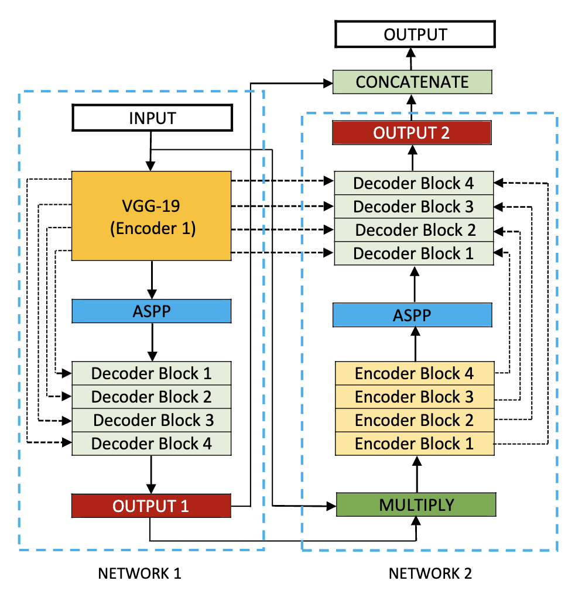

# DoubleUNet
DoubleUNet for medical image segmentation (PyTorch)

## Architecture

## Datasets:
The following datasets are used in this experiment:
<ol>
  <li><a href="https://datasets.simula.no/kvasir-seg/">Kvasir-SEG</a></li>
  <li><a href="https://polyp.grand-challenge.org/CVCClinicDB/">CVC-ClinicDB</a></li>
  <li><a href="http://mv.cvc.uab.es/projects/colon-qa/cvccolondb">CVC-ColonDB</a></li>
  <li><a href="https://polyp.grand-challenge.org/EtisLarib/">Data-science-Bowl</a></li>
    <li><a href="https://polyp.grand-challenge.org/EtisLarib/">Skin-lesion-segmentation</a></li>
 </ol>
